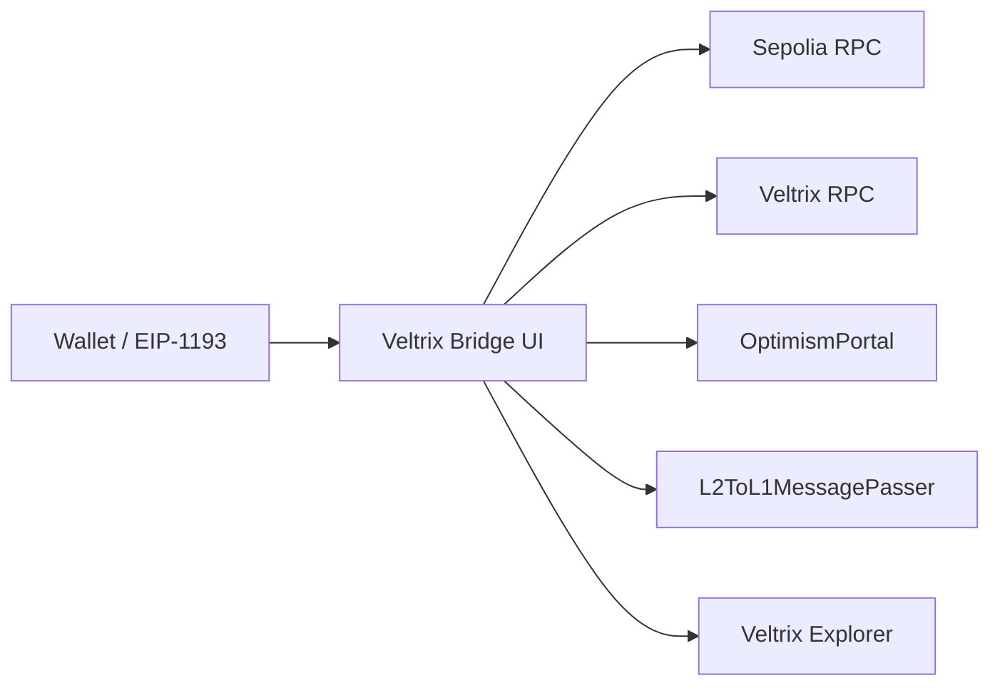

# Veltrix Bridge

User-facing bridge frontend for moving **VEL** between **Sepolia L1** and **Veltrix L2**.


**Live app:** https://veltrix-bridge.vercel.app

## Features

- Connect EIP-1193 wallets (MetaMask-compatible).
- Load VEL balances on Sepolia L1 and Veltrix L2.
- Deposit VEL via `OptimismPortal.depositTransaction`.
- Initiate withdrawals via `L2ToL1MessagePasser.initiateWithdrawal`.
- Resolve withdrawal lifecycle (initiated → prove readiness → finalize readiness → finalized) from live chain state.
- Submit `proveWithdrawalTransaction` and `finalizeWithdrawalTransaction` directly from the UI.
- Track recent submitted bridge transactions with explorer deep links.

## Architecture



## Tech Stack

### Frontend
- React
- Vite
- Lucide React

### Tooling
- ESLint
- GitHub Actions
- Vercel

## Installation

```bash
git clone https://github.com/404Piyush/veltrix-bridge.git
cd veltrix-bridge
npm install
npm run dev
```

Open `http://localhost:5173`.

## Environment Variables

Copy `.env.example` and override values only when needed:

```bash
cp .env.example .env.local
```

```env
VITE_L2_RPC_URL=https://veltrix-rpc.404piyush.me
VITE_L2_CHAIN_ID=0xce608
VITE_L2_EXPLORER_URL=https://veltrix-explorer.404piyush.me/tx/
VITE_L2_EXPLORER_ROOT=https://veltrix-explorer.404piyush.me
VITE_L2_NATIVE_NAME=Veltrix
VITE_L2_NATIVE_SYMBOL=VEL
VITE_L2_NATIVE_DECIMALS=18
VITE_OPTIMISM_PORTAL=0x9d6954E55297f9ae78e5c0dc2353c18b31aeA0b3
VITE_L2_MESSAGE_PASSER=0x4200000000000000000000000000000000000016
```

Set `VITE_L2_CHAIN_ID` to the chain ID currently returned by your Veltrix RPC (`0xce608` / `845320`).

## Usage

1. Connect wallet.
2. Load Sepolia and Veltrix balances.
3. Deposit from Sepolia or initiate withdrawal from Veltrix.
4. Open transaction links from the activity panel for chain confirmation.
5. Use **Refresh lifecycle**, **Prove withdrawal**, and **Finalize withdrawal** in the lifecycle panel.

## Contracts and Network Defaults

| Item | Value |
| --- | --- |
| Sepolia Chain ID | `0xaa36a7` |
| Veltrix L2 Chain ID | `VITE_L2_CHAIN_ID` (`0xce608` / `845320`) |
| OptimismPortal | `0x229Fa2F406ff759Bc763988b4c3CBbbC2C5e0934` |
| L2ToL1MessagePasser | `0x4200000000000000000000000000000000000016` |
| Veltrix RPC | `https://veltrix-rpc.404piyush.me` |
| Veltrix Explorer | `https://veltrix-explorer.404piyush.me` |

## CI

The repository runs CI on pushes and pull requests to `main`:

- `npm run lint`
- `npm run build`

## Deploy

```bash
npm run lint
npm run build
npx vercel --prod
```

## Folder Structure

```text
.
├── .github
│   ├── ISSUE_TEMPLATE
│   └── workflows
├── assets
├── screenshots
├── src
│   ├── App.jsx
│   ├── index.css
│   └── main.jsx
├── .env.example
└── README.md
```

## Roadmap

- Add clearer waiting reason buckets (output root wait, game maturity wait, finality delay wait).
- Add persisted history of prove/finalize transactions.
- Improve transaction history depth and filtering.
- Add domain-level deployment docs and operational runbooks.

## Contributing

See [CONTRIBUTING.md](./CONTRIBUTING.md).

## Security

See [SECURITY.md](./SECURITY.md).
